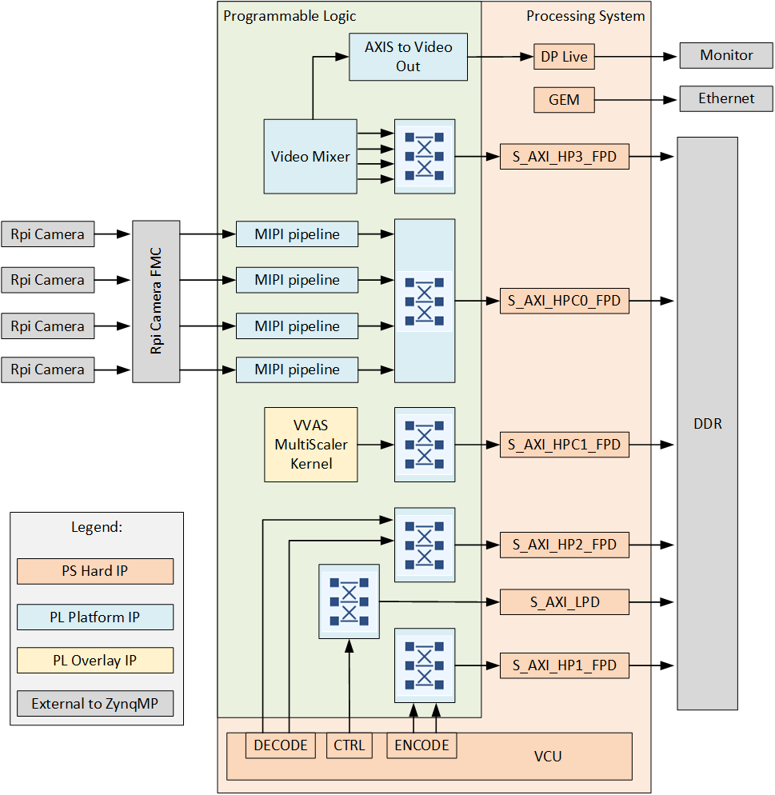
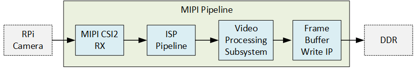
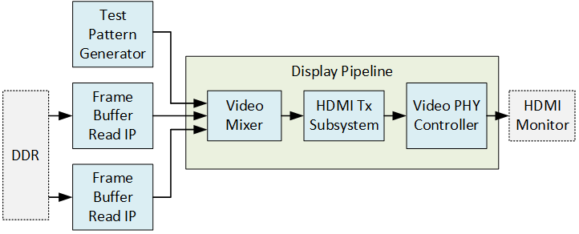
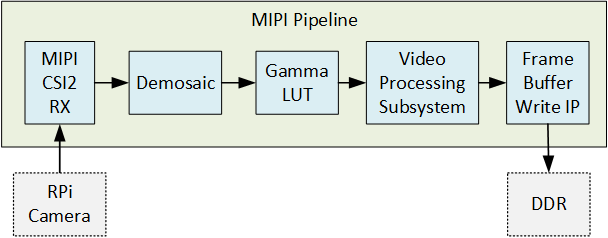

# Reference design for RPi Camera FMC

## Description

This project demonstrates the Opsero [RPi Camera FMC] (OP068) used to
connect up to 4x Raspberry Pi cameras (or compatible cameras) to one of the target FPGA/MPSoC boards listed below. The 
designs contain:

* 4x MIPI CSI-2 capture pipelines
* Video Mixer IP based display pipeline to DisplayPort/HDMI output
* Video Codec Unit ([VCU])


Important links:
* The RPi Camera FMC [datasheet](https://docs.opsero.com/op068/datasheet/overview/)
* The [user guide](https://rpi.camerafmc.com) for these reference designs
* To [report an issue](https://github.com/fpgadeveloper/rpi-camera-fmc/issues)
* For technical support: [Contact Opsero](https://opsero.com/contact-us)

## Architectures

The designs in this repository fall into two main architectural categories:

1. **Zynq UltraScale+ designs** – These designs integrate the ISP Pipeline IP, run within a PetaLinux environment, 
   and output video to a DisplayPort monitor.
2. **FPGA designs** – These designs implement a simpler video pipeline, are controlled by a bare-metal application, 
   and output video to an HDMI monitor.

### Zynq UltraScale+ designs

The high level block diagram below illustrates the design:


The video pipe sub-blocks are illustrated below:


### FPGA designs

Display pipeline of the FPGA designs:


The video pipeline of the FPGA designs:


## Requirements

This project is designed for version 2025.2 of the Xilinx tools (Vivado/Vitis/PetaLinux). 
If you are using an older version of the Xilinx tools, then refer to the 
[release tags](https://github.com/fpgadeveloper/rpi-camera-fmc/tags "releases")
to find the version of this repository that matches your version of the tools.

In order to test this design on hardware, you will need the following:

* Vivado 2025.2
* Vitis 2025.2
* One or more [Raspberry Pi Camera Module 2](https://www.raspberrypi.com/products/camera-module-v2/) and/or 
  [Digilent Pcam 5C](https://digilent.com/shop/pcam-5c-5-mp-fixed-focus-color-camera-module/) cameras
* 1x [RPi Camera FMC]
* One of the supported target boards listed below

### Design specific requirements

* **Zynq UltraScale+ designs**:
  * PetaLinux Tools 2025.2
  * 1x DisplayPort monitor that supports 1080p video
  * Linux build PC (or virtual machine)
  
* **FPGA designs**:
  * 1x HDMI monitor that supports 1080p video
  * [License for the HDMI IP](https://www.amd.com/en/products/adaptive-socs-and-fpgas/intellectual-property/hdmi.html) (evaluation license available)

## Target designs

<!-- updater start -->
### FPGA designs

| Target board          | Target design   | FMC Slot | Cameras | VCU   | Baremetal<br> App | PetaLinux<br> Build | Yocto<br> Build | Vivado<br> Edition | IP<br>License |
|-----------------------|-----------------|----------|---------|-------|-------|-------|-------|-------|-------|
| [AUBoard 15P]         | `auboard`       | HPC      | 2     | :x:                | :white_check_mark: | :x:                | :x:                | Standard :free: | -     |

### Zynq UltraScale+ designs

| Target board          | Target design   | FMC Slot | Cameras | VCU   | Baremetal<br> App | PetaLinux<br> Build | Yocto<br> Build | Vivado<br> Edition | IP<br>License |
|-----------------------|-----------------|----------|---------|-------|-------|-------|-------|-------|-------|
| [ZCU104]              | `zcu104`        | LPC      | 4     | :white_check_mark: | :x:                | :white_check_mark: | :white_check_mark: | Standard :free: | -     |
| [ZCU102]              | `zcu102_hpc0`   | HPC0     | 4     | :x:                | :x:                | :white_check_mark: | :white_check_mark: | Standard :free: | -     |
| [ZCU102]              | `zcu102_hpc1`   | HPC1     | 2     | :x:                | :x:                | :white_check_mark: | :white_check_mark: | Standard :free: | -     |
| [ZCU106]              | `zcu106_hpc0`   | HPC0     | 4     | :white_check_mark: | :x:                | :white_check_mark: | :white_check_mark: | Standard :free: | -     |
| [PYNQ-ZU]             | `pynqzu`        | LPC      | 2     | :x:                | :x:                | :white_check_mark: | :white_check_mark: | Standard :free: | -     |
| [UltraZed-EV Carrier] | `uzev`          | HPC      | 4     | :white_check_mark: | :x:                | :white_check_mark: | :white_check_mark: | Standard :free: | -     |

[AUBoard 15P]: https://www.avnet.com/americas/products/avnet-boards/avnet-board-families/auboard-15p-fpga-development-kit/
[ZCU104]: https://www.xilinx.com/zcu104
[ZCU102]: https://www.xilinx.com/zcu102
[ZCU106]: https://www.xilinx.com/zcu106
[PYNQ-ZU]: https://www.amd.com/en/corporate/university-program/aup-boards/pynq-zu.html
[UltraZed-EV Carrier]: https://www.xilinx.com/products/boards-and-kits/1-1s78dxb.html
<!-- updater end -->

Notes:
1. The Vivado Edition column indicates which designs are supported by the Vivado *Standard* Edition, the
   FREE edition which can be used without a license. Vivado *Enterprise* Edition requires
   a license however a 30-day evaluation license is available from the AMD Xilinx Licensing site.
2. The HPC1 connector of the ZCU102 board can only support 2 cameras due to it's pin assignment. This design
   supports the `CAM0` and `CAM1` slots as labelled on the RPi Camera FMC.
3. The `pynqzu` target design has video pipelines for only 2 cameras: `CAM1` and `CAM2` as
   labelled on the RPi Camera FMC. This is due to the resource limitations of the devices on this board.
4. The `auboard` target design has video pipelines for only 2 cameras: `CAM0` and `CAM2` as labelled
   on the RPi Camera FMC. This is due to the resource limitations of the Artix UltraScale+ device on this board.

## Software

### Baremetal application

Some of these designs can be driven by a baremetal application that will configure the connected cameras
and combine their video outputs into a single 1080p stream.

### PetaLinux

The Zynq UltraScale+ based reference designs can be driven within a PetaLinux environment. 
The repository includes all necessary scripts and code to build the PetaLinux environment. The table 
below outlines the corresponding applications available:

| Environment      | Available Applications  |
|------------------|-------------------------|
| PetaLinux        | Built-in Linux commands<br>Additional tools: [GStreamer] |

## Build instructions

Clone the repo and change into its directory:
```
git clone --recursive https://github.com/fpgadeveloper/rpi-camera-fmc.git
cd rpi-camera-fmc
```

### Cross-platform build runner

All builds are driven by `build.py` at the repo root, on both Windows
(git bash) and Linux. The `build.sh` / `build.bat` shim finds a suitable
Python 3 automatically (including the one bundled with the AMD tools).
Pick a target design label from the tables above (or run `./build.sh
list`), then run the build command for the stage(s) you want — each
command builds whatever it depends on automatically and skips anything
already built. On Windows without git bash, run the same commands from
Command Prompt or PowerShell using `build.bat` (e.g. `build.bat xsa
--target <target>`).

You don't need to source the AMD tools first — the build runner finds
Vivado, Vitis and PetaLinux automatically in their standard install
locations and sets up the environment each stage needs. If your tools
are installed somewhere non-standard and the runner can't find them,
source the tool settings yourself before running the build.

#### Build the Vivado project (bitstream + XSA)

```
./build.sh xsa --target <target>
```

#### Build the standalone application

Builds the Vitis workspace and the baremetal boot file (`BOOT.BIN` or
bit file, depending on the device family):

```
./build.sh standalone --target <target>
```

#### Build PetaLinux (Linux only)

```
./build.sh petalinux --target <target>
```

#### Build everything

Builds all of the above that the target supports, then gathers the boot
images into `bootimages/*.zip`:

```
./build.sh all --target <target>
./build.sh all --target all          # every target in the repo
```

Also available: `status`, `clean`, `project` — see
`./build.sh --help`. On Windows, the PetaLinux and Yocto stages require a
Linux machine; the runner says so and prints the hand-off command. The
legacy `make` interface still works on Linux (each Makefile now wraps
`build.sh`) but is deprecated and will be removed at the next version
update.

## Launch instructions

### FPGA designs

Launch Vitis, open the workspace that was generated using the make command. Select the test application and run it on the target
board.

### Zynq UltraScale+ designs

From the PetaLinux command line, run the following command to stream video from all *connected* cameras to the 4 quadrants of the 
1080p DisplayPort monitor:

```
sudo displaycams.sh
```

If less than 4 cameras are physically connected, the unused quadrants of the monitor will be blue.

## Contribute

We strongly encourage community contribution to these projects. Please make a pull request if you
would like to share your work:
* if you've spotted and fixed any issues
* if you've added designs for other target platforms
* if you've added software support for other cameras

Thank you to everyone who supports us!

### The TODO list

* Develop PYNQ support
* Add a standalone application for the Zynq and ZynqMP designs
* Add support for some Versal boards
* Add VCU example scripts
* Get a Genesys-ZU board and test the design on hardware.
* Software support for more cameras (this will be an ongoing task due to the number of cameras available).

## About us

[Opsero Inc.](https://opsero.com "Opsero Inc.") is a team of FPGA developers delivering FPGA products and 
design services to start-ups and tech companies. Follow our blog, 
[FPGA Developer](https://www.fpgadeveloper.com "FPGA Developer"), for news, tutorials and
updates on the awesome projects we work on.

[RPi Camera FMC]: https://docs.opsero.com/op068/datasheet/overview/
[GStreamer]: https://gstreamer.freedesktop.org/
[VCU]: https://xilinx-wiki.atlassian.net/wiki/spaces/A/pages/18842546/Xilinx+Zynq+UltraScale+MPSoC+Video+Codec+Unit

