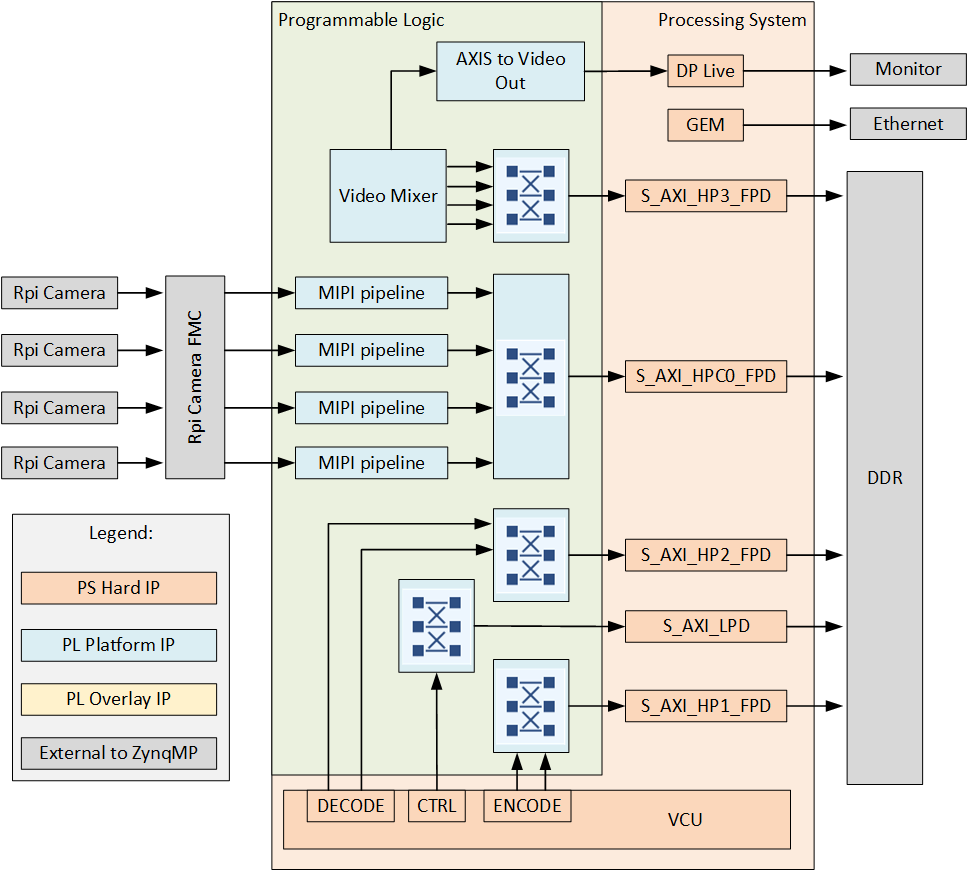
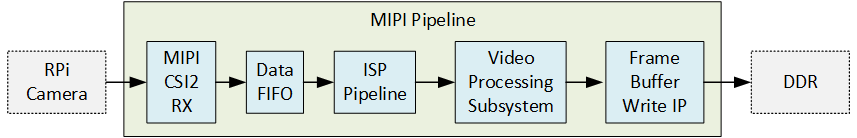

# Reference design for RPi Camera FMC

## Description

This project demonstrates the Opsero [RPi Camera FMC] (OP068) used to
connect 4x Raspberry Pi cameras (or compatible cameras) to one of the target FPGA/MPSoC boards listed below. The 
designs contain:

* 4x MIPI CSI capture pipelines
* Video Mixer IP based display pipeline to DisplayPort output
* Video Codec Unit ([VCU])


The high level block diagram below illustrates the design:


The video pipe sub-blocks are illustrated below:


Important links:
* The RPi Camera FMC [datasheet](https://camerafmc.com/docs/rpi-camera-fmc/overview/)
* The [user guide](https://rpi.camerafmc.com) for these reference designs
* To [report an issue](https://github.com/fpgadeveloper/rpi-camera-fmc/issues)
* For technical support: [Contact Opsero](https://opsero.com/contact-us)

## Requirements

This project is designed for version 2024.1 of the Xilinx tools (Vivado/Vitis/PetaLinux). 
If you are using an older version of the Xilinx tools, then refer to the 
[release tags](https://github.com/fpgadeveloper/rpi-camera-fmc/tags "releases")
to find the version of this repository that matches your version of the tools.

In order to test this design on hardware, you will need the following:

* Vivado 2024.1
* Vitis 2024.1
* PetaLinux Tools 2024.1
* Linux PC for build
* One or more [Raspberry Pi Camera Module 2](https://www.raspberrypi.com/products/camera-module-v2/) and/or 
  [Digilent Pcam 5C](https://digilent.com/shop/pcam-5c-5-mp-fixed-focus-color-camera-module/) cameras
* 1x [RPi Camera FMC]
* 1x DisplayPort monitor that supports 1080p video
* One of the supported target boards listed below

## Target designs

<!-- updater start -->
### FPGA designs

| Target board          | Target design   | FMC Slot | Cameras | VCU   | Vivado<br> Edition |
|-----------------------|-----------------|----------|---------|-------|-------|
| [AUBoard 15P]         | `auboard`       | HPC      | 1     | :x:                | Standard :free: |

### Zynq UltraScale+ designs

| Target board          | Target design   | FMC Slot | Cameras | VCU   | Vivado<br> Edition |
|-----------------------|-----------------|----------|---------|-------|-------|
| [ZCU104]              | `zcu104`        | LPC      | 4     | :white_check_mark: | Standard :free: |
| [ZCU102]              | `zcu102_hpc0`   | HPC0     | 4     | :x:                | Standard :free: |
| [ZCU102]              | `zcu102_hpc1`   | HPC1     | 2     | :x:                | Standard :free: |
| [ZCU106]              | `zcu106_hpc0`   | HPC0     | 4     | :white_check_mark: | Standard :free: |
| [PYNQ-ZU]             | `pynqzu`        | LPC      | 2     | :x:                | Standard :free: |
| [UltraZed-EV Carrier] | `uzev`          | HPC      | 4     | :white_check_mark: | Standard :free: |

[AUBoard 15P]: https://www.avnet.com/americas/products/avnet-boards/avnet-board-families/auboard-15p-fpga-development-kit/
[ZCU104]: https://www.xilinx.com/zcu104
[ZCU102]: https://www.xilinx.com/zcu102
[ZCU106]: https://www.xilinx.com/zcu106
[PYNQ-ZU]: https://www.amd.com/en/corporate/university-program/aup-boards/pynq-zu.html
[UltraZed-EV Carrier]: https://www.xilinx.com/products/boards-and-kits/1-1s78dxb.html
<!-- updater end -->

Notes:
1. The Vivado Edition column indicates which designs are supported by the Vivado *Standard* Edition, the
   FREE edition which can be used without a license. Vivado *Enterprise* Edition requires
   a license however a 30-day evaluation license is available from the AMD Xilinx Licensing site.
2. The HPC1 connector of the ZCU102 board can only support 2 cameras due to it's pin assignment. This design
   supports the `CAM0` and `CAM1` slots as labelled on the RPi Camera FMC.
3. The `pynqzu` target design has video pipelines for only 2 cameras: `CAM1` and `CAM2` as
   labelled on the RPi Camera FMC. This is due to the resource limitations of the devices on this board.

## Software

These reference designs can be driven within a PetaLinux environment. 
The repository includes all necessary scripts and code to build the PetaLinux environment. The table 
below outlines the corresponding applications available:

| Environment      | Available Applications  |
|------------------|-------------------------|
| PetaLinux        | Built-in Linux commands<br>Additional tools: [GStreamer] |

## Build instructions

This repo contains submodules. To clone this repo, run:
```
git clone --recursive https://github.com/fpgadeveloper/rpi-camera-fmc.git
```

Source Vivado and PetaLinux tools:

```
source <path-to-petalinux>/2024.1/settings.sh
source <path-to-vivado>/2024.1/settings64.sh
```

Build all (Vivado project, accelerator kernel and PetaLinux):

```
cd rpi-camera-fmc/PetaLinux
make petalinux TARGET=uzev
```

## Launch instructions

From the PetaLinux command line, run the following command to stream video from all *connected* cameras to the 4 quadrants of the 
1080p DisplayPort monitor:

```
sudo displaycams.sh
```

If less than 4 cameras are physically connected, the unused quadrants of the monitor will be blue.

## Contribute

We strongly encourage community contribution to these projects. Please make a pull request if you
would like to share your work:
* if you've spotted and fixed any issues
* if you've added designs for other target platforms
* if you've added software support for other cameras

Thank you to everyone who supports us!

### The TODO list

* Develop PYNQ support
* Add a standalone application
* Add support for some Versal boards
* Add VCU example scripts
* Get a Genesys-ZU board and test the design on hardware.
* Software support for more cameras (this will be an ongoing task due to the number of cameras available).

## About us

[Opsero Inc.](https://opsero.com "Opsero Inc.") is a team of FPGA developers delivering FPGA products and 
design services to start-ups and tech companies. Follow our blog, 
[FPGA Developer](https://www.fpgadeveloper.com "FPGA Developer"), for news, tutorials and
updates on the awesome projects we work on.

[RPi Camera FMC]: https://camerafmc.com/docs/rpi-camera-fmc/overview/
[GStreamer]: https://gstreamer.freedesktop.org/
[VCU]: https://xilinx-wiki.atlassian.net/wiki/spaces/A/pages/18842546/Xilinx+Zynq+UltraScale+MPSoC+Video+Codec+Unit

