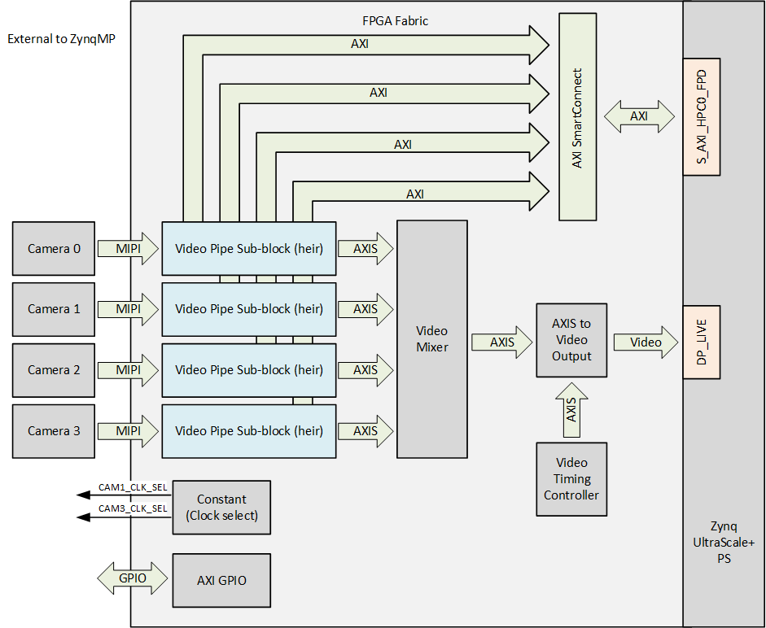
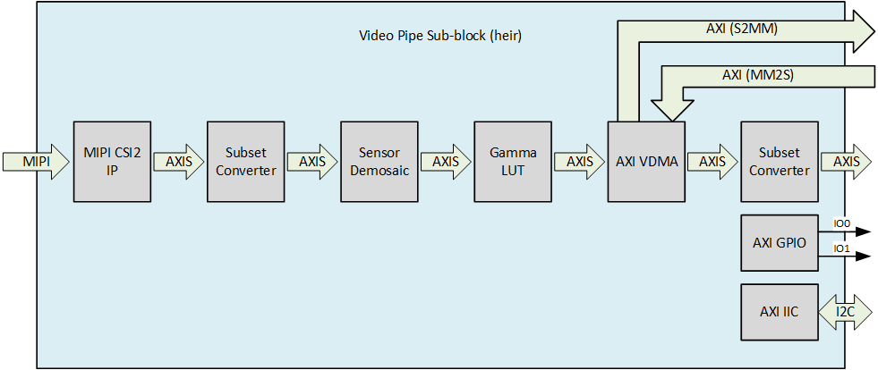

# Description

This reference design demonstrates the use of the [RPi Camera FMC] with 4x cameras and 1x DisplayPort monitor 
attached. The video streams coming from each camera pass through a video pipe composed of the 
[AMD Xilinx MIPI CSI Controller Subsystem IP] and other video processing IP. The cameras can be utilized
either through a standalone software application or via [GStreamer] in PetaLinux.

## FPGA (hardware) design

The hardware design for these projects is built in Vivado and is composed of IP that implement the
MIPI interface with the cameras, as well as a video pipe and signal generation for the DisplayPort
monitor. The block diagram below illustrates the design from the top level.

    
The block diagram below illustrates the video pipe:

    
## Software design

The reference designs support both bare-metal and PetaLinux OS configurations. There's a standalone 
software application included which consolidates the four video streams into a single 1080p output for 
display on the monitor. For those who prefer using an OS, scripts are provided to build a PetaLinux
distribution that facilitates camera integration with standard Linux tools, including GStreamer.

See the following sections for more information on the software components of this project:

* [Standalone application](standalone)
* [PetaLinux](petalinux)

[AMD Xilinx MIPI CSI Controller Subsystem IP]: https://docs.xilinx.com/r/en-US/pg202-mipi-dphy
[RPi Camera FMC]: https://camerafmc.com/docs/rpi-camera-fmc/overview/
[GStreamer]: https://gstreamer.freedesktop.org/

