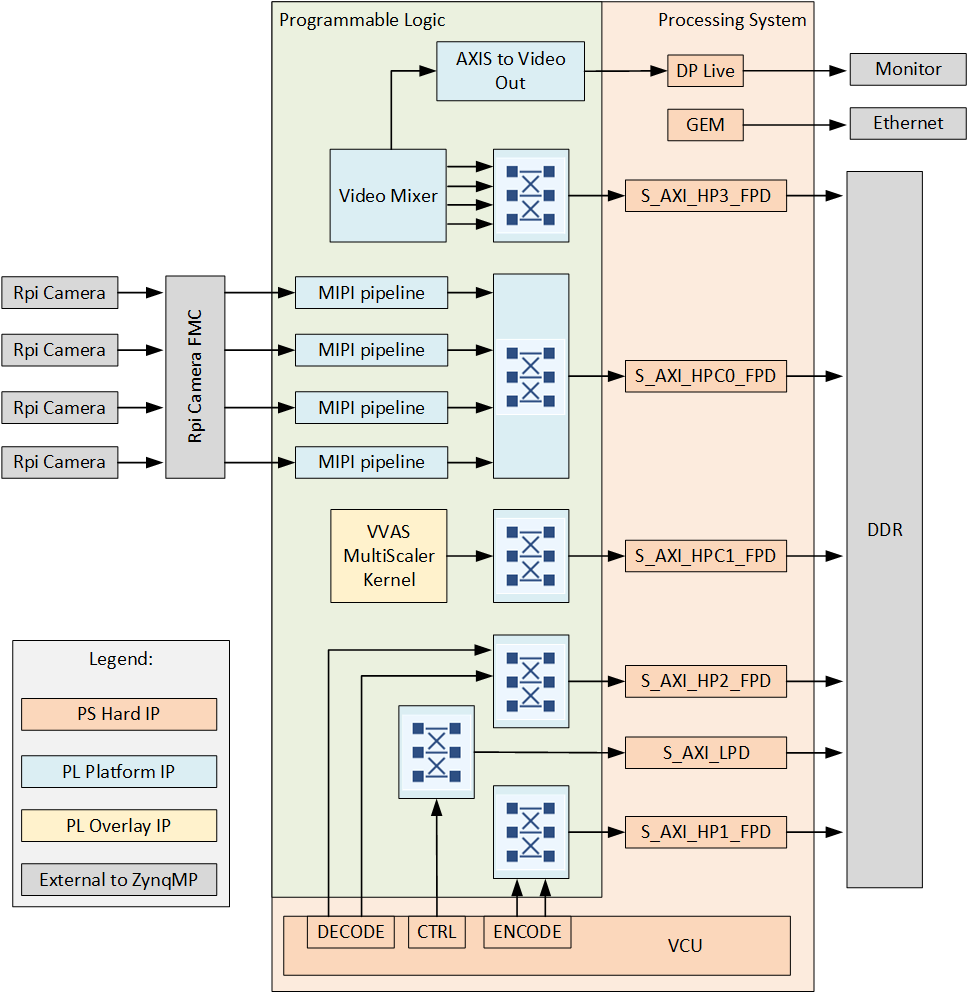
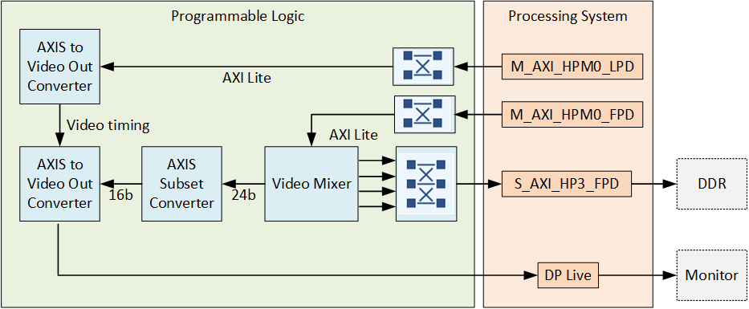
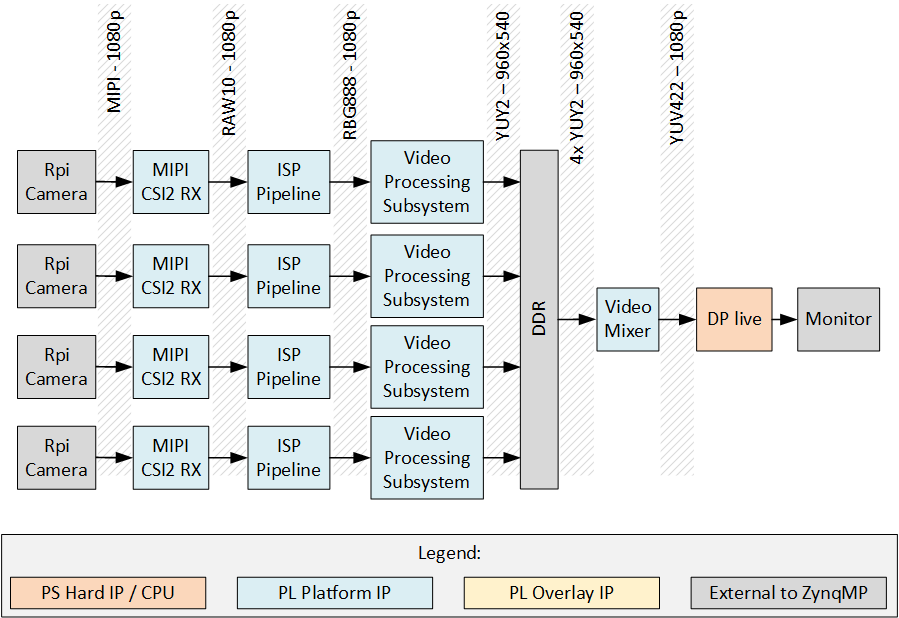

# Description

This reference design demonstrates the use of the [RPi Camera FMC] with 4x cameras and 1x DisplayPort monitor 
attached. The video streams coming from each camera pass through a video pipe composed of the 
[AMD Xilinx MIPI CSI Controller Subsystem IP] and other video processing IP. The cameras can be utilized
through [GStreamer] in PetaLinux.

## Architecture

The hardware design for these projects is built in Vivado and is composed of IP that implement the
MIPI interface with the cameras, VCU and image processing hardware accelerator as well as a display pipeline.
The main elements are:

* 4x Raspberry Pi cameras each with an independent MIPI capture pipeline that writes to the DDR
* Video Mixer based display pipeline that writes to the DisplayPort live interface of the ZynqMP
* Image processing accelerator ([VVAS MultiScaler])
* Video Codec Unit ([VCU])

The block diagram below illustrates the design from the top level.

### Capture pipeline

There are four main capture/input pipelines in this design, one for each of the 4x Raspberry Pi cameras. 
The capture pipelines are composed of the following IP, implemented in the PL of the Zynq UltraScale+:

* [MIPI CSI-2 Receiver Subsystem IP](https://docs.xilinx.com/r/en-US/pg232-mipi-csi2-rx)
* [ISP Pipeline of the Vitis Libraries](https://github.com/Xilinx/Vitis_Libraries/tree/main/vision/L3/examples/isppipeline)
* [Video Processing Subsystem IP](https://docs.xilinx.com/r/en-US/pg231-v-proc-ss)
* [Frame Buffer Write IP](https://docs.xilinx.com/r/en-US/pg278-v-frmbuf)

The MIPI CSI-2 RX IP is the front of the pipeline and receives image frames from the Raspberry Pi camera 
over the 2-lane MIPI interface. The MIPI IP generates an AXI-Streaming output of the frames in RAW10 format. The 
ISP Pipeline IP performs BPC (Bad Pixel Correction), gain control, demosaicing and auto white balance, to output 
the image frames in RGB888 format. The Video Processing Subsystem IP performs scaling and color space conversion 
(when needed). The Frame Buffer Write IP then writes the frame data to memory (DDR). The image below illustrates 
the MIPI pipeline. 

### Display pipeline

The display pipeline reads frames from memory (DDR) and sends them to the monitor. To allow for four video streams to be
displayed on a single monitor, the design uses the Video Mixer IP with four overlay inputs configured as memory mapped 
AXI4 interfaces. The Video Mixer IP can be thus configured to read four video streams from memory and send them to the
monitor via the DisplayPort live input of the ZynqMP. The input layers of the Video Mixer IP are configured for YUY2 
(to this Video Mixer this is YUYV8). The output of the mixer is set to an AXI-Streaming video interface with YUV 422 
format, to satisfy the DisplayPort live interface.

### End-to-end pipeline

The end-to-end pipeline shows an example of the flow of image frames through the entire system, from source to sink.
In the diagram, the image resolutions and pixel formats are shown at each interface between the image processing
blocks. The resolution and pixel format can be dynamically changed at the output of the RPi camera, the scaler 
(Video Processing Subsystem IP) and the VVAS accelerator.

### VVAS accelerator

To enable hardware accelerated image processing in this design, the [VVAS MultiScaler] kernel is included. The 
accelerator can be used for resizing, color space conversion and more. All of the accelerator features are implemented
through a set of [GStreamer plug-ins] from the VVAS packages that are built into the PetaLinux projects.

### Video Codec Unit

For some of the target boards, the Zynq UltraScale+ device contains a hardened Video Codec Unit (VCU) that can be used to
perform video encoding and decoding of multiple video standards. On those target designs, we have included the VCU to 
enable these powerful features. Refer to the list of target designs to see which boards support this feature.

## Software design

This section has yet to be written.

[AMD Xilinx MIPI CSI Controller Subsystem IP]: https://docs.xilinx.com/r/en-US/pg202-mipi-dphy
[RPi Camera FMC]: https://camerafmc.com/docs/rpi-camera-fmc/overview/
[GStreamer]: https://gstreamer.freedesktop.org/
[VVAS MultiScaler]: https://xilinx.github.io/VVAS/2.0/build/html/docs/common/Acceleration-Hardware.html#multiscaler-kernel
[VCU]: https://xilinx-wiki.atlassian.net/wiki/spaces/A/pages/18842546/Xilinx+Zynq+UltraScale+MPSoC+Video+Codec+Unit
[G-Streamer plugins]: https://xilinx.github.io/VVAS/2.0/build/html/docs/common/common_plugins.html

