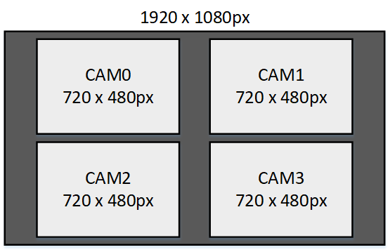

# Stand-alone application

The reference designs in this project can be used with a standalone application that runs on
the ARM processor of the Zynq UltraScale+ device. The application performs configuration of
the cameras, the video pipes, the video mixer and the DisplayPort monitor. When running, the
video streams from all connected cameras are displayed in a 2x2 grid on the monitor.



The standalone application provides a starting platform for developing baremetal video applications.
It also demonstrates the baremetal use of some key elements in an FPGA based video pipe such as the 
Video Processing Subsystem IP, the Video Mixer IP, and the live video interface of the ZynqMP.

## Building the Vitis workspace

To build the Vitis workspace and standalone application, you must first generate
the Vivado project hardware design (the bitstream) and export the hardware to XSA file.
Once the bitstream is generated and exported, then you can build the
Vitis workspace using the provided scripts. Follow the instructions appropriate for your
operating system:

* **Windows**: Follow the [build instructions for Windows users](/build_instructions.md#windows-users)
* **Linux**: Follow the [build instructions for Linux users](/build_instructions.md#linux-users)

## Hardware setup

Before running the application, you will need to setup the hardware.

1. Connect one or more cameras to the [RPi Camera FMC] and then plug it into the target board.
   Instructions for doing this, including images of the correct flex cable orientation, can be 
   found in the [Getting started](https://camerafmc.com/docs/rpi-camera-fmc/getting-started/#hardware-setup)
   guide.
2. Connect a DisplayPort monitor to the target board. This monitor must be able to support 1080p
   resolution.
3. To receive the UART output of this standalone application, you will need to connect the
   USB-UART of the development board to your PC and run a console program such as 
   [Putty]. The UART speed must be set to 115200.


## Run the application

1. Launch the Xilinx Vitis GUI.
2. Power up your hardware platform and ensure that the JTAG is connected properly.
3. In the Vitis Explorer panel, double-click on the System project that you want to run -
   this will reveal the application contained in the project. The System project will have 
   the postfix "_system".
4. Now right click on the application (it should have the postfix "_app") then navigate the
   drop down menu to **Run As->Launch on Hardware (Single Application Debug (GDB)).**.


The run configuration will first program the FPGA with the bitstream, then load and run the 
application. You can view the UART output of the application in a console window and it should
appear as follows:

```
Xilinx Zynq MP First Stage Boot Loader
Release 2022.1   Sep 14 2023  -  15:24:31
PMU-FW is not running, certain applications may not be supported.
---------------------------------------
 4x RPi camera to Display Port example
---------------------------------------
Detected 4 connected cameras
HPD event .......... ! Connected.
Lane count =    2
Link rate =     20

Starting Training...
        ! Training succeeded.
DONE!
.......... HPD event
IMX219 camera configured
IMX219 camera configured
IMX219 camera configured
IMX219 camera configured
```


[RPi Camera FMC]: https://camerafmc.com/docs/rpi-camera-fmc/overview/
[Putty]: https://www.putty.org
